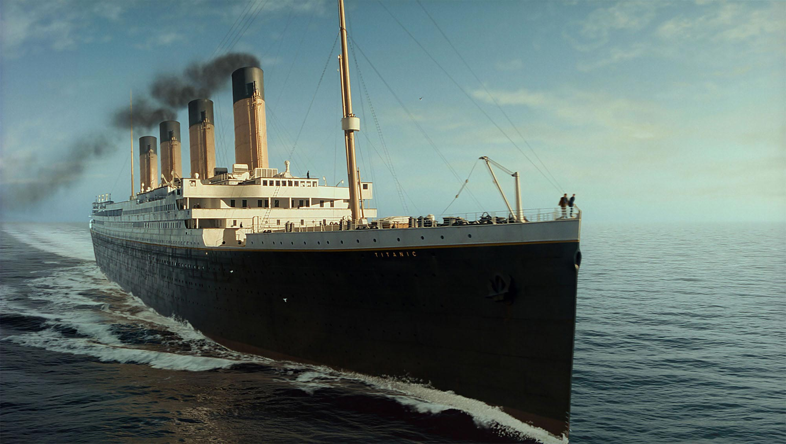
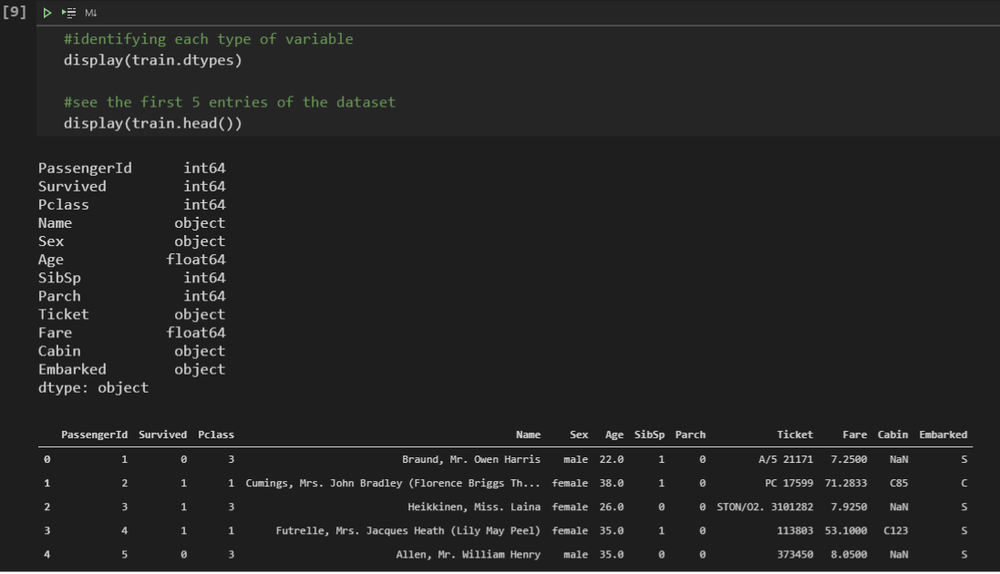

Welcome to TitanicByPy's!
=======================================

Documentation:
https://titanicbypy.readthedocs.io/en/latest/index.html

## Before starting
Attention to requires for the project.
~~~
> pip install requirements.txt
~~~

## Important
> Python version >= 3.6

 The entire procedure is in the notebook file:
 > titanicByPy.ipynb

 I used **VSCode** with **Jupyter extension** for this project. You may feel free to use the source of your choice.

#
#

 # About

 ## Investigating the Wreck of the RMS Titanic

 

Certainly, most people know the story behind the wreck of what would be the most modern ship in the world at the time. Despite the available technology, after colliding with an iceberg on April 15, 1912, its wreckage killed 1502 people out of a total of 2224 passengers. There are not enough lifeboats for the entire crew and passengers, in addition to several irresponsible attitudes on the part of the crew.

We know, those who survived the wreck were very lucky, but we know that some groups of passengers were “luckier” than other groups. We know that children and women actually had a better chance of surviving. Did Jack have any less chance of escaping his tragic fate than Rose, just because he boarded third class?

With real data available, we can perform exploratory analysis, test hypotheses, and even build a predictive model. We can find out, for example, what our chances of survival in first class would be if we had traveled with our partner and child.

This document aims to describe the entire analysis, where we will, at first, understand the problem. Next, we will explore the data and build two Machine Learning models (Logistic Regression and Decision Tree) to generate predictions.
#
#
## Checklist
It is convenient that we follow a framework, a flowchart or at least a checklist with some essential steps for a good analysis, like every Data Science project. For this project, we will follow the steps below:

1. Problem Definition

2. Obtaining the Data

3. Data Exploration

4. Data Preparation

5. Modeling

6. Assessment

We want to break a problem into well-defined steps, making our analysis more robust. Our aim is basically to use available data to measure the probability of survival of passengers on the Titanic.

#
## [1] Problem Definition
At this initial stage, we want to analyze and fully understand the problem. For this, we should reflect on the construction of the Titanic, which took about 2 years and cost 7.5 million dollars (values ​​at the time). At 269 meters long, 28 meters wide and 53 meters high, it operated with a crew of 892 people and could carry up to 2435 passengers (spread across the three available classes).

The ship, designed to be the safest and most luxurious of the time, was launched in 1911, gaining a reputation for being “unsinkable”.

The shipwreck had as contributing factors natural causes, such as the climate, and human causes (neglect and overconfidence). Regardless of the causes, the fact is that its shipwreck killed 1502 people out of a total of 2224 passengers.

Although the people who managed to survive were very lucky, some groups of people were more likely to escape death than others. For example, women, children and first class passengers. So, we can see that there is some pattern that can be extracted from the raw data.

### Objective 
We hope to get an **analysis of which variables had the greatest influence on the probability of survival** (i.e. what type of person was most likely to escape in life).

After **analyzing** the data, we will build a model that gives the survival prediction for any passenger provided as an input value.

### Performance Metrics
We hope to get an analysis of which variables had the greatest influence on the probability of survival (i.e. what type of person was most likely to escape in life).

After analyzing the data, we will build a model that gives the survival prediction for any passenger provided as an input value.
 #

## Obtaining the Data

### Training Dataset (train.csv)

Used to build the Machine Learning model. In this dataset, it is informed whether the passenger survived or not. It comprises several features, such as passenger gender and boarding class.

### Test Dataset (test.csv)

It should be used as data never seen by the model. In this dataset, it is not informed whether the passenger survived or not.

#

## Data Exploration

The most important step in the project. Here, we will take most of our time. Often, initial questions and hypotheses can only be answered with a well-done exploratory analysis. If it is necessary to build a model, its performance will be directly linked to the quality of this analysis. In this step, we will:

* Study each attribute and its characteristics, such as:

    * Name;
    * Type (numeric, categorical, float, int, etc);
    * % of missing values ​​for each column;
    * Presence of noise or outliers;
    * Distribution type (Gaussian, uniform, logarithmic).

* Identify the target variable

* Identify correlations;

* View data graphically;

As we are dealing with Supervised Learning, the Survived variable is easily identified as our target variable. Of great importance, let’s build a data dictionary, to know exactly what each column means.

#### Data Dictionary 

* PassengerId: Passenger identification number

* Survived: Informs whether the passenger survived the disaster

    * 0 = No

    *  1 = Yes

* Pclass: Ticket Class:

    * 1 = 1st Class

    * 2 = 2nd Class

    * 3 = 3rd Class

* Name: Passenger Name

* Sex: Gender of the passenger

* Age: Age of passenger

* SibSp: Number of spouses and siblings on board

* Parch: Number of parents and children on board

* Ticket: Ticket number

* Fare: Ticket Price

* Cabin: Passenger cabin number

* Embarked: Port at which the passenger boarded:

    * C = Cherbourg

    * Q = Queenstown

    * S = Southampton

Once this is done, we can ask some questions to formulate hypotheses:

* **What types of each variable?**

We already know what each column represents, so let’s take a look at the first entries and see which variables are numeric and which are categorical.

* **What percentage of missing values?**

Cabin information has the most missing information, with more than 77%. Afterwards, the Age column has no value in almost 20% of passengers. Finally, the column informing the Port of Embarkation (Embarked) has only 2% of missing information.

 

 ### Statistical distribution of data

 Using Pandas .describe() method and plotting a histogram, we will have an overview of the distribution of each variable and possible outliers and missing values. This will be useful in the next step when we will work on cleaning the data, deciding whether to delete an entry that has a missing value or fill in with the mean/median, for example.

### Which groups of people were most likely to survive?

From here, we can already test a hypothesis mentioned at the beginning: are women, in fact, more likely to survive the sinking of the Titanic? It is worth looking at the correlations and relationships between the variables, whether to decide which ones will go into a future model or to formulate new hypotheses.

From the chart above, we have already been able to confirm two initial assumptions:

* Women are much more likely to survive than men (75% vs. 18%);

* Passengers in 3rd Class have less than half the chance of escaping disaster than passengers in 1st Class.

Looking also at the age distribution of survivors and dead, we can see a peak on the survivors side for young children. The behavior of the two graphics is very similar, but this detail is very important, as it confirms the hypothesis that children also have a greater chance of surviving: *“Children and women first!”.*

We can take advantage of an interesting type of graphic from Pandas, the scatter_matrix.

We can see that the advantage of using this graph is that we get a very useful information of its diagonal, which displays a histogram of each attribute. So we can see things like, for example, the fact that older people are more concentrated in first grade and younger people are more concentrated in third grade. Finally, finishing this first exploratory analysis step, we can analyze the heatmap to understand how the variables are correlated, positively or negatively.

Another interesting thing is that the df.describe() method can also be used to visualize something about descriptive statistics in columns that are not numbers. To do this, just pass the include=[‘O’] argument.

From these data, we can note that:

* Values ​​for Name are unique, one for each person;

* There are no missing values ​​for Name and Sex;

* There are only male and female genders, with a higher frequency of males (577/891 = 65%);

* The port in which the most passengers boarded is S = Southampton.

After first step, we were able to become aware of the situation, understanding the problem, the main variables and starting to visualize the numerical variables.

Next, we will analyze the categorical variables in more detail. We’ll also cover missing values ​​(NaN) and how to deal with them. We want to prepare the data to feed the model.

# 

## Data Preparation

We will work on categorical variables, cleaning up data and handling missing information, and start preparing our predictive model, where we will first test Logistic Regression techniques.

From now on, we will start to build a feature engineering segmentation, that is, we will process the data to make it ready for our Machine Learning models: Logistic Regression and Decision Tree.

We import the data into DataFrame structures, formulate hypotheses, initiate an exploratory data analysis and visualize graphs and correlations between those variables that we deem relevant.

### Joining the training and test datasets
 
As we are preparing data for an ML model, it is a good idea to merge the training and test datasets into a single one, to separate again at the end, to ensure that the data will follow the same structure when we do feature engineering, so we will train the model on top of this architecture .

### Selecting features

As with any real world dataset, we will always come across data that won’t do any good and others that won’t be very significant in the model. We will have to choose which features will be used for the ML model we are going to develop. In this case, let’s consider the variables

~~~
[‘PassengerId’, ‘Name’, ‘Ticket’, ‘Cabin’]
~~~

because apparently they don’t seem relevant.

Thus, we are left with the following variables to be treated and prepared:

~~~
[‘Pclass’, ‘Sex’, ‘Age’, ‘SibSp’, ‘Parch’, ‘Fare’, ‘Embarked’]
~~~

### Missing Values

We’ll now take a look at the missing values ​​in each column and let’s treat these empty fields. There are two most used approaches to dealing with missing values:

* Fill in these values ​​arbitrarily (average, median, most frequent value);

* Delete the entire line.

In order not to throw out information from an entire line just because of a missing field, we can fill the field.

For the age and rate variables, we placed the median value; and for the port of shipment variable, we put the value more frequently.

### Preparing the variables to modeling

We will need to work with numeric variables, so we will transform input data that is in category format to numbers.

We can convert possible values ​​of Sex to {‘male’:0, ‘female’:1}. Regarding the Embarked variable, we can apply the concept of dummy variables.

### Retrieving training and testing datasets

We prepare the dataset for the model and let’s divide df_merged into train and test, as it was in the beginning.

#

## Data Modeling

### Regression and Logistics Model

**With practically two lines, we built a Logistic Regression model with 80% accuracy of the training dataset.** 

The .fit() method optimizes the objective function of the problem and stores the “ideal” weights inside the variable itself, becoming an attribute.

We can predict the test dataset with the .predict() method.

I took the opportunity and submitted the csv file to Kaggle to compare the performance:

The model managed to achieve a score of 75%. From what I’ve been studying, it’s not uncommon for us to underperform when submitting predictions, as our model was trained 100% on top of the training set, which means it has a better fit to the dataset train.

### Decision Tree Model

Now, we create a Decision Tree model, find the curve (fit) on top of the training data and check the accuracy. There was a gain in accuracy reaching almost 83%.

Likewise, I trained the model, performing the prediction and, after that, I submitted the cvs to Kaggle.

Well, we improved our performance on top of the test suite, achieving a score of approximately 78%.

 
#

## Assessment

### Would I survive the sinking?
Since the model is already trained and with good accuracy, I thought it might be interesting to carry out a check with our own data. I’m a passenger traveling in third class, at the age of 26, my father at 53 and my mother at 49. My uncle, 70 years old, in first class together with my aunt, 65 years old. My 30-year-old cousin Ana, however, also decided to go to second grade. We paid the full Ticket price and boarded at the port of Southampton, UK (uh, how fancy).

Let’s then create five models containing the values ​​of each variable and pass them as arguments to the predict() method.

Unfortunately, according to my own model, I wouldn’t have survived the Titanic disaster, not even my parents and uncle. My aunts were classified as survivors. It seems that the reality portrayed in the James Cameron film has some truths.

