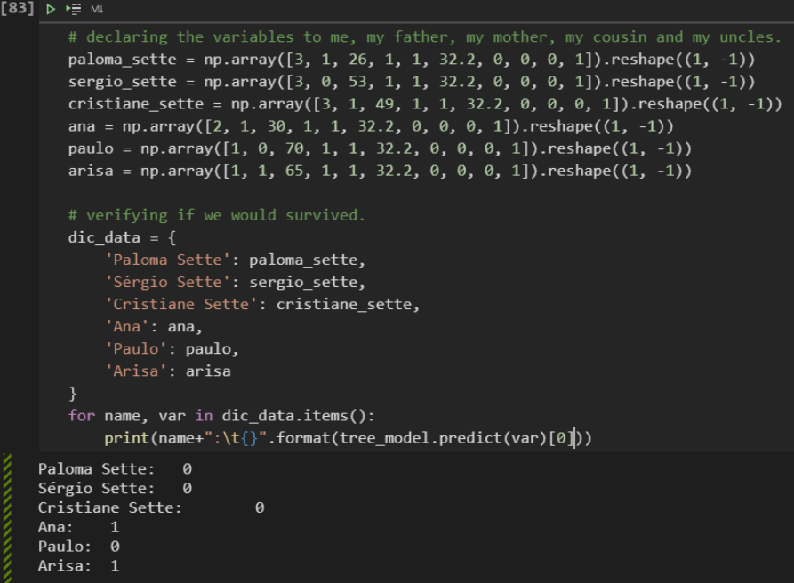

=============================
Would I survive the sinking?
=============================

Since the model is already trained and with good accuracy, I thought it might be interesting to carry out a check with our own data. I'm a passenger traveling in third class, at the age of 26, my father at 53 and my mother at 49. My uncle, 70 years old, in first class together with my aunt, 65 years old. My 30-year-old cousin Ana, however, also decided to go to second grade. We paid the full Ticket price and boarded at the port of Southampton, UK (uh, how fancy).

Let's then create five models containing the values ​​of each variable and pass them as arguments to the predict() method.

Unfortunately, according to my own model, I wouldn't have survived the Titanic disaster, not even my parents and uncle. My aunts were classified as survivors. It seems that the reality portrayed in the James Cameron film has some truths.