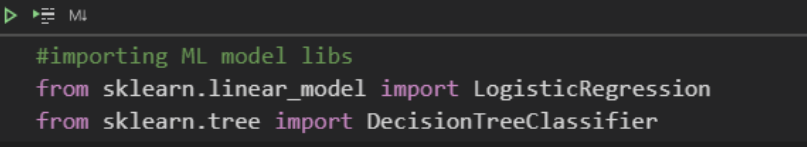
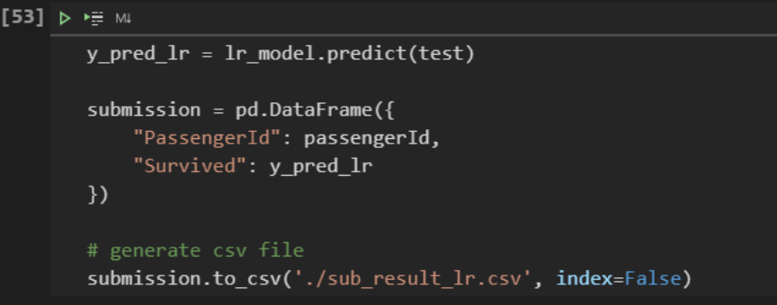

===============================
Regression and Logistics Model
===============================

**With practically two lines, we built a Logistic Regression model with 80% accuracy of the training dataset.**

The *.fit()* method optimizes the objective function of the problem and stores the “ideal” weights inside the variable itself, becoming an attribute.

We can predict the test dataset with the .predict() method.

I took the opportunity and submitted the csv file to Kaggle to compare the performance:

.. image:: images/_18_.png
    :width: 700
    :alt: Alternative text

The model managed to achieve a score of 75%. From what I've been studying, it's not uncommon for us to underperform when submitting predictions, as our model was trained 100% on top of the training set, which means it has a better fit to the dataset train.